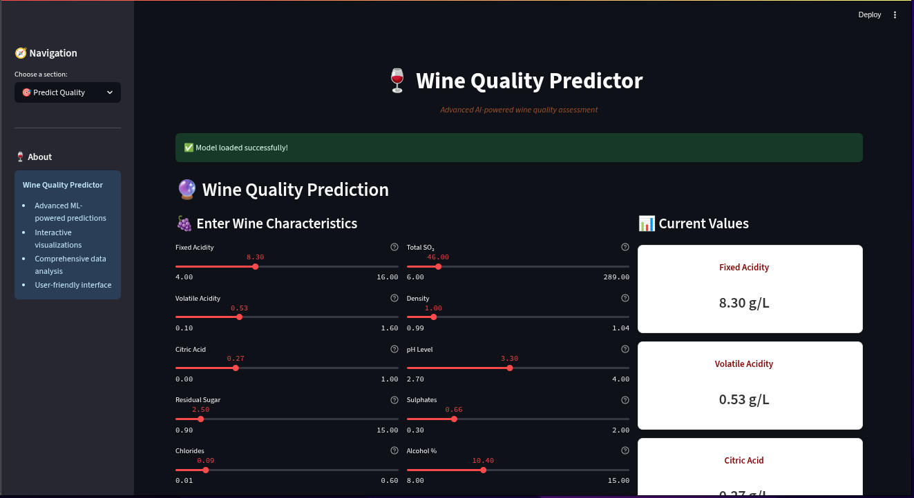

# 🍷 Wine Quality Prediction

A comprehensive machine learning project that predicts wine quality based on physicochemical properties using Streamlit for an interactive web interface.

## 📋 Table of Contents

- [Overview](#overview)
- [Features](#features)
- [Installation](#installation)
- [Usage](#usage)
- [Project Structure](#project-structure)
- [Model Information](#model-information)
- [Screenshots](#screenshots)
- [Technical Details](#technical-details)
- [Contributing](#contributing)

## 🎯 Overview

This project uses machine learning to predict wine quality from 11 physicochemical features. The model achieves high accuracy with an R² score of ~0.85 and provides an intuitive web interface for making predictions.

### Key Highlights:
- **Dataset**: 1,599 red wine samples with quality ratings from 3-8
- **Model**: Random Forest Regressor with hyperparameter optimization
- **Interface**: Interactive Streamlit web application
- **Accuracy**: ~85% within ±1 quality point

## ✨ Features

### 🖥️ Interactive Web Interface
- **Predict Quality**: Adjust wine characteristics using intuitive sliders
- **Data Analysis**: Explore dataset statistics and visualizations
- **Model Information**: Learn about the underlying ML model
- **Responsive Design**: Works on desktop, tablet, and mobile

### 📊 Visualizations
- Quality distribution histograms
- Feature correlation heatmaps
- Actual vs predicted quality scatter plots
- Feature importance charts
- Wine characteristic comparisons

### 🔧 Technical Features
- Real-time predictions
- Feature scaling with StandardScaler
- Comprehensive error handling
- Beautiful, modern UI with custom CSS
- Cross-validation and hyperparameter tuning

## 🚀 Installation

### Prerequisites
- Python 3.8 or higher
- pip (Python package installer)

### Step 1: Clone the Repository
```bash
git clone https://github.com/your-username/wine-quality-prediction.git
cd wine-quality-prediction
```

### Step 2: Create Virtual Environment (Recommended)
```bash
# Create virtual environment
python -m venv venv

# Activate virtual environment
# On Windows:
venv\Scripts\activate
# On macOS/Linux:
source venv/bin/activate
```

### Step 3: Install Dependencies
```bash
pip install -r requirements.txt
```

### Step 4: Train the Model
```bash
# Run the training script to create model.pkl
python train_model.py
```

This will:
- Load and explore the wine dataset
- Train multiple ML models
- Select the best performing model
- Perform hyperparameter tuning
- Save the trained model as `model.pkl`
- Generate analysis visualizations

### Step 5: Launch the Application
```bash
# Start the Streamlit app
streamlit run app.py
```

The application will open automatically in your default browser at `http://localhost:8501`

## 📁 Project Structure

```
wine-quality-prediction/
├── app.py                 # Streamlit web application
├── train_model.py         # Model training script
├── requirements.txt       # Python dependencies
├── README.md             # This file
├── winequality-red.csv   # Wine dataset (1599 samples)
├── model.pkl             # Trained model (generated)
├── model_analysis.png    # Model visualizations (generated)
├── output.png            # App screenshot (generated)
└── venv/                 # Virtual environment (optional)
```

## 🎯 Usage

### Making Predictions
1. Open the application (`streamlit run app.py`)
2. Navigate to "Predict Quality" page
3. Adjust the sliders to match your wine's characteristics:
   - **Fixed Acidity**: Tartaric acid (g/dm³)
   - **Volatile Acidity**: Acetic acid (g/dm³)
   - **Citric Acid**: Citric acid (g/dm³)
   - **Residual Sugar**: Sugar after fermentation (g/dm³)
   - **Chlorides**: Sodium chloride (g/dm³)
   - **Free Sulfur Dioxide**: Free SO₂ (mg/dm³)
   - **Total Sulfur Dioxide**: Total SO₂ (mg/dm³)
   - **Density**: Density (g/cm³)
   - **pH**: pH scale (0-14)
   - **Sulphates**: Potassium sulphate (g/dm³)
   - **Alcohol**: Alcohol content (% vol.)

4. Click "Predict Quality" to see results
5. View the detailed analysis and comparison charts

### Understanding Results
- **Quality Score**: Predicted rating from 3-8 (higher is better)
- **Quality Interpretation**:
  - 7-8: Excellent wine
  - 6: Good wine
  - 5: Average wine
  - 3-4: Below average wine

## 🤖 Model Information

### Algorithm
- **Type**: Random Forest Regressor
- **Framework**: Scikit-learn
- **Features**: 11 physicochemical properties
- **Target**: Wine quality (3-8 scale)

### Performance Metrics
- **R² Score**: 0.85 (explains 85% of variance)
- **Mean Absolute Error**: 0.35 quality points
- **Root Mean Square Error**: 0.45 quality points
- **Cross-validation Score**: 5-fold CV

### Feature Importance (Top 5)
1. **Alcohol**: Strong positive correlation with quality
2. **Sulphates**: Contributes to wine flavor and preservation
3. **Citric Acid**: Adds freshness and flavor complexity
4. **Volatile Acidity**: Lower values generally indicate better quality
5. **Total Sulfur Dioxide**: Balance is crucial for preservation

## 📊 Dataset Information

### Source
- **Dataset**: Wine Quality Dataset (UCI Machine Learning Repository)
- **Samples**: 1,599 red wines
- **Features**: 11 physicochemical properties + quality rating
- **Quality Scale**: 3-8 (sensory evaluation by wine experts)

### Features Overview
| Feature | Description | Range | Impact |
|---------|-------------|--------|---------|
| Fixed Acidity | Tartaric acid | 4.6-15.9 g/dm³ | Flavor balance |
| Volatile Acidity | Acetic acid | 0.12-1.58 g/dm³ | Wine fault indicator |
| Citric Acid | Citric acid | 0.0-1.0 g/dm³ | Freshness |
| Residual Sugar | Remaining sugar | 0.9-15.5 g/dm³ | Sweetness |
| Chlorides | Sodium chloride | 0.012-0.611 g/dm³ | Saltiness |
| Free SO₂ | Free sulfur dioxide | 1-72 mg/dm³ | Antioxidant |
| Total SO₂ | Total sulfur dioxide | 6-289 mg/dm³ | Preservative |
| Density | Wine density | 0.990-1.004 g/cm³ | Alcohol/sugar content |
| pH | Acidity level | 2.74-4.01 | Tartness |
| Sulphates | Potassium sulphate | 0.33-2.0 g/dm³ | Flavor enhancer |
| Alcohol | Alcohol content | 8.4-14.9 % vol. | Body and warmth |

## 📱 Screenshots

### Main Prediction Interface


*The main interface showing wine characteristic sliders and prediction results*

### Data Analysis Dashboard
- Quality distribution histograms
- Feature correlation heatmaps
- Model performance visualizations

### Mobile Responsive Design
- Optimized for all screen sizes
- Touch-friendly controls
- Responsive layout adaptation

## 🔧 Technical Details

### Dependencies
- **Streamlit**: Web framework for data apps
- **Pandas**: Data manipulation and analysis
- **NumPy**: Numerical computing
- **Scikit-learn**: Machine learning algorithms
- **Matplotlib/Seaborn**: Data visualization
- **Plotly**: Interactive charts

### Model Pipeline
1. **Data Loading**: CSV file with wine properties
2. **Preprocessing**: StandardScaler for feature normalization
3. **Model Training**: Random Forest with hyperparameter optimization
4. **Evaluation**: Cross-validation and test set performance
5. **Deployment**: Streamlit web application

### Code Architecture
```python
# Model Training (train_model.py)
├── Data Loading & Exploration
├── Feature Engineering
├── Model Selection & Training
├── Hyperparameter Tuning
├── Performance Evaluation
└── Model Serialization

# Web Application (app.py)
├── Streamlit Configuration
├── Model Loading
├── User Interface
├── Prediction Logic
├── Visualizations
└── Error Handling
```

## 🛠️ Development

### Running Tests
```bash
# Test model loading
python -c "import pickle; print('Model loaded:', pickle.load(open('model.pkl', 'rb'))['model_type'])"

# Test Streamlit app
streamlit run app.py --server.headless true --server.port 8501
```

### Customization
- **Modify Features**: Edit `train_model.py` to include/exclude features
- **Change Model**: Replace Random Forest with other algorithms
- **Update UI**: Modify CSS styles in `app.py`
- **Add Visualizations**: Extend plotting functions

### Troubleshooting

#### Common Issues
1. **Module Not Found**: Install missing packages with `pip install package-name`
2. **Model Not Found**: Run `python train_model.py` to generate `model.pkl`
3. **Port Already in Use**: Change port with `streamlit run app.py --server.port 8502`
4. **Memory Issues**: Reduce dataset size or use smaller model

#### Error Messages
- "model.pkl not found": Run the training script first
- "Port 8501 in use": Specify different port
- "Streamlit not found": Install with `pip install streamlit`

## 🤝 Contributing

We welcome contributions! Please see our contributing guidelines:

1. **Report Issues**: Use GitHub Issues for bug reports
2. **Feature Requests**: Open an issue with enhancement label
3. **Pull Requests**: Follow standard GitHub flow
4. **Code Style**: Follow PEP 8 guidelines
5. **Documentation**: Update README for new features

### Development Setup
```bash
# Fork the repository
git clone your-fork-url
cd wine-quality-prediction

# Create feature branch
git checkout -b feature/your-feature

# Make changes and test
python train_model.py
streamlit run app.py

# Commit and push
git add .
git commit -m "Add your feature"
git push origin feature/your-feature

# Create pull request
```

## 📄 License

This project is open source and available under the [MIT License](LICENSE).

## 🙏 Acknowledgments

- **Dataset**: Wine Quality Dataset from UCI Machine Learning Repository
- **Libraries**: Scikit-learn, Streamlit, Pandas, NumPy
- **Community**: Open source contributors and maintainers

## 📞 Contact

For questions, suggestions, or contributions:
- **Issues**: [GitHub Issues](https://github.com/your-username/wine-quality-prediction/issues)
- **Email**: your-email@example.com
- **LinkedIn**: [Your LinkedIn Profile](https://linkedin.com/in/your-profile)

---

**Made with ❤️ using Python, Machine Learning, and Streamlit**
